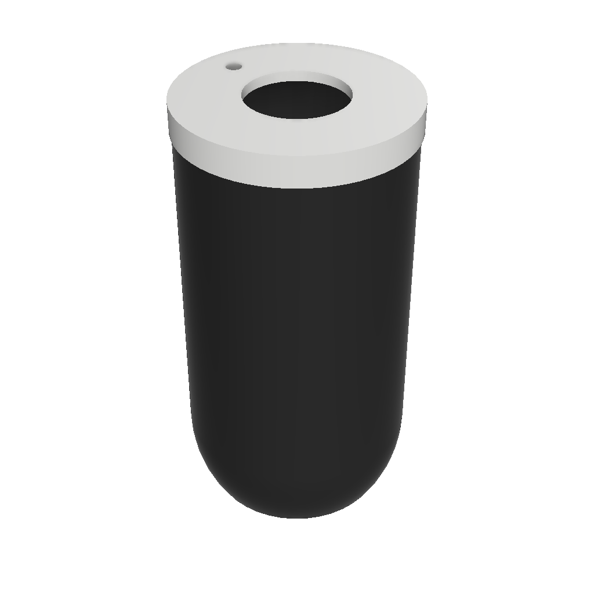
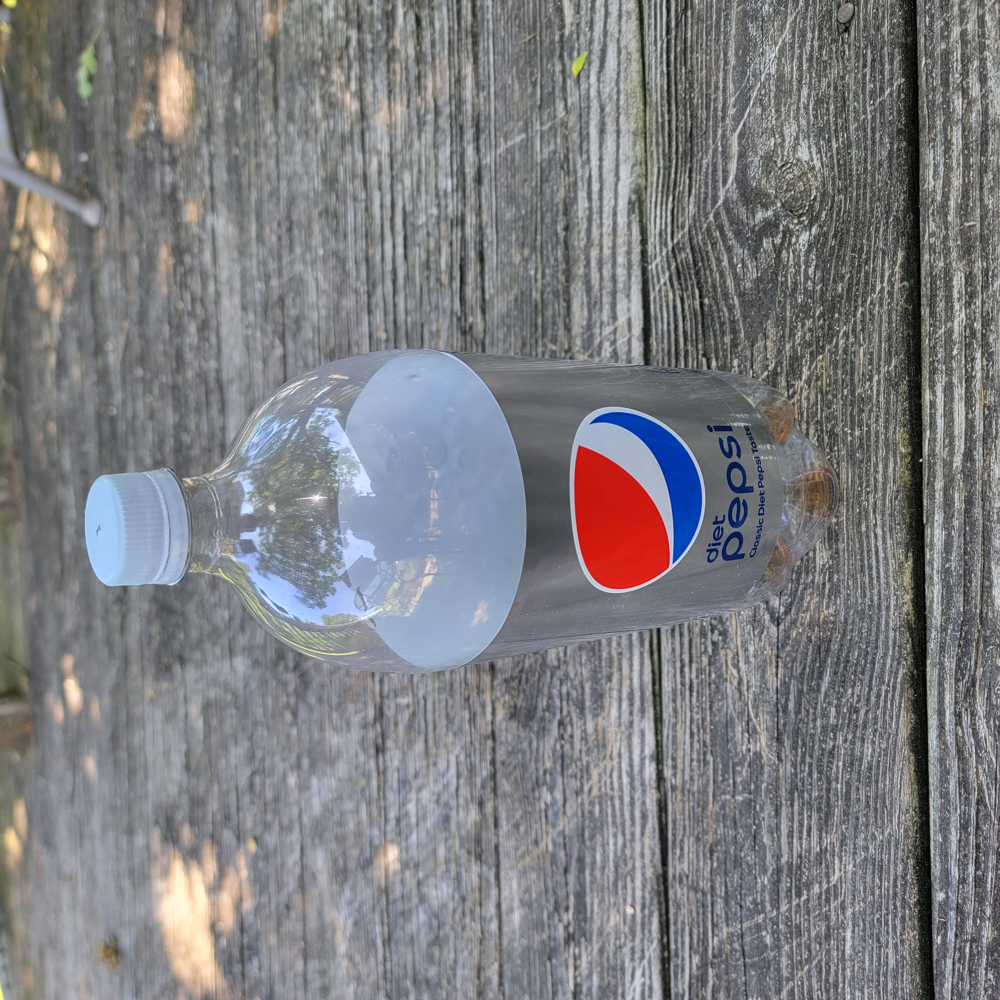
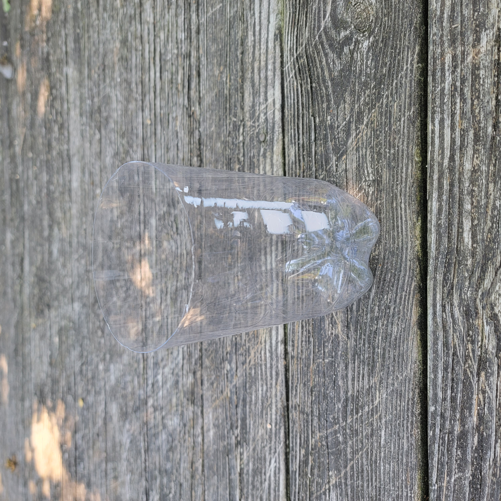
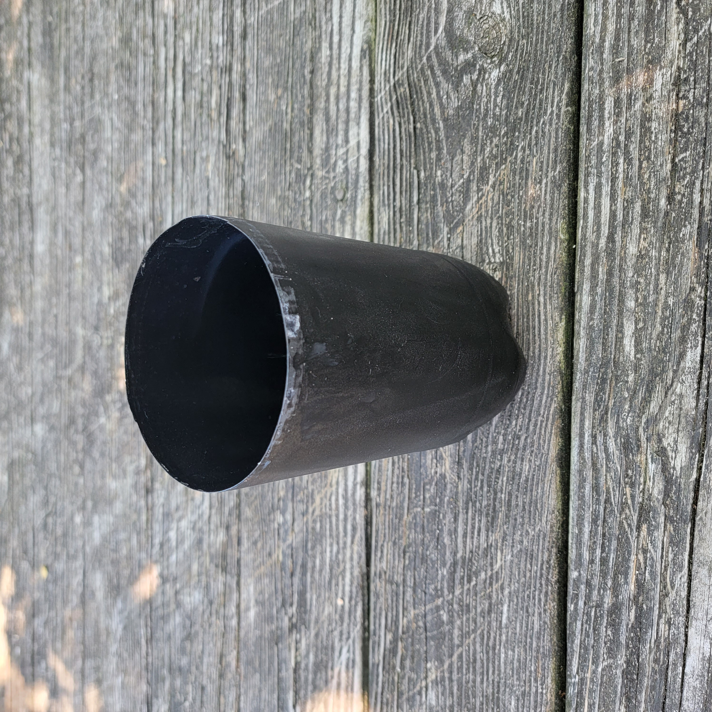
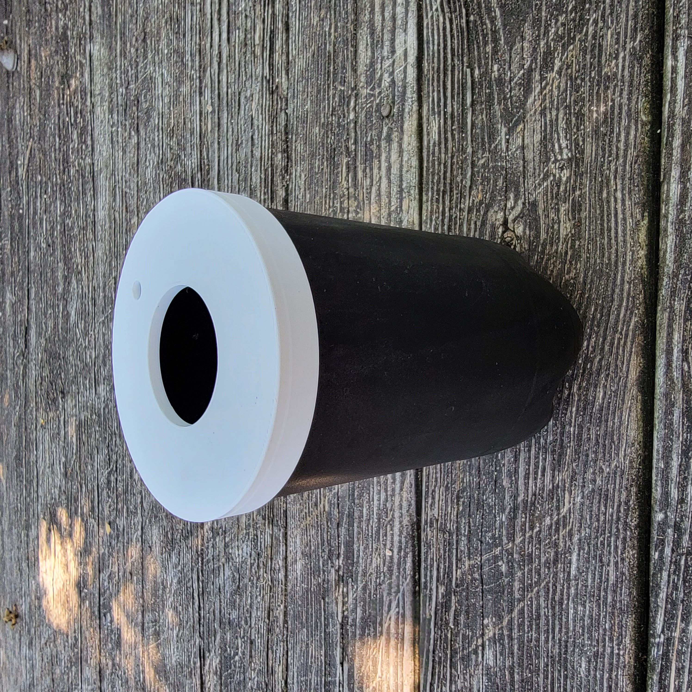

<h1 align="center">
   
  
   
  Soda Bottle Kratky - Hydroponics
   
</h1>

<h4 align="center">An extremely simple, easy and inexpensive hydroponics setup.</h4>

  <a href="#key-features">Key Features</a> •
<a href="#how-to-set-up">Set Up</a> •
  <a href="#materials">Materials</a> •
  <a href="#license">License</a>

## Key Features

* Very inexspensive to make
* Easy for kids
* Repurpose empty 2 liter soda bottle
* Custom 3D printed parts
  * Lid with hole for netcup

## How to set up

### Materials

#### Purchasable Parts

| Name     | Price | Qty | Link |
|----------|:-----:|----:|------|
| 2L Pepsi | $1.00 |   1 | None |

> **Notice:**
> Prices varies based on location and time of purchase. This should only be used as a broad estimate

#### 3D Printable parts
| Name | Qty |             File             |                                      Image                                       |
|------|:---:|:----------------------------:|:--------------------------------------------------------------------------------:|
| Lid  |  1  |  2 Liter Bottle Cap v7.stl   |           |
> **Notice:**
> You do not have permission to redistribute these designs or physical parts for commercial purposes.

### Step 1: Acquire a 2 Liter soda bottle

### Step 2: Cut off the top 
Cut off the top at the end of the label or where the soda bottle stop curving inward

### Step 3: Paint it black
Paint the entire bottle black except for the inside. I found that if you flip the part you cut off in step 2 and flip it upside down and insert into the bottle, this will prevent paint from getting inside the bottle. Make sure that no light can penetrate into the bottle, this will prevent algae from growing inside the bottle.

> **Note:**
> I'm not the best at painting.

### Step 4: Place on the cap
Simply place the 3D-Printed cap over the top of the bottle.

## License

Attribution-NonCommercial-ShareAlike 4.0 International

https://creativecommons.org/licenses/by-nc-sa/4.0/